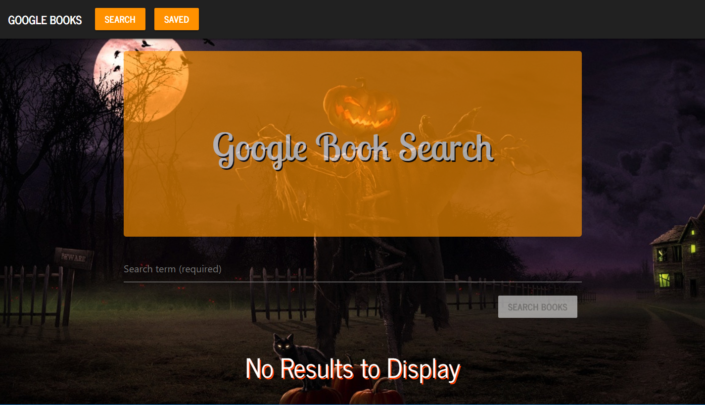
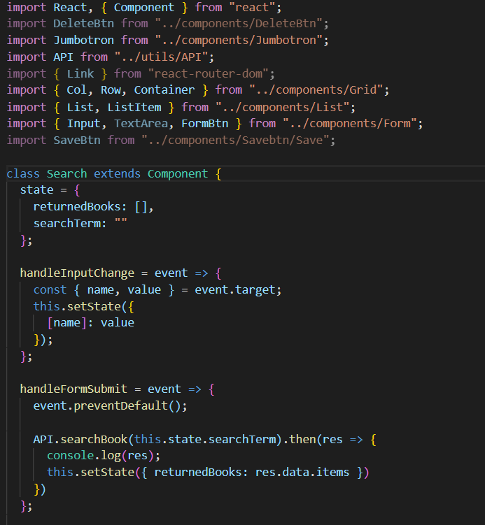

# Google Book Search

[Deployed Link]()

Collaborators |
:---------:
* Samuel Thompson
* Denis Galo
* Halina Zmachynskaya
* Max Weidmer

## Description
### This is a web application designed to help users to search and look for book using the google books api. You can search for books and then save the book info. For this project we used materlize and bootstrap for styling. Express and mongo were used for handling the data an d

### 

## Screenshots/GIFS

Search Page |
:------------------:
 |

Save Page |
:------------------:
 |

404 Error |
:------------------:
 |

## Important Code Details

Search  |
:------------------:
 |

Listing item|
:------------------:
 |

Technologies Used |
:---------:
* React
* Javascript
* CSS
* JQuery
* Materlize
* Mongo
* express
* cors
* Bootstrap